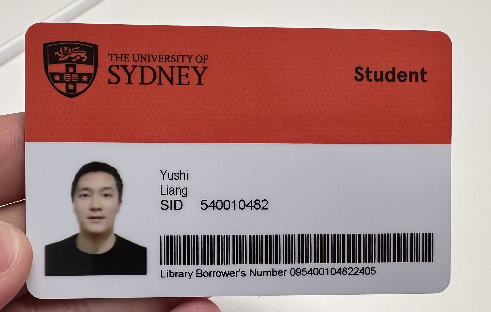

# BBBBBBBrandon_9103_tut9_Quiz 8
# Header
## Header
# **Hola**
## *Hola in italic*


# PART 1

# Imaging technique
1. Identify an imaging technique that you find inspiring for your assignment. This could be from an artwork, a design project, a film clip, or a movie.

    - Weighted Voroni stippling & Image to ASCII & Geometric shaping


# Aspect incorporated and beneficial to our project
2. Write a maximum of 100 words discussing which aspect of the example you'd like to incorporate into your project and why you believe it's a beneficial technique considering the assignment requirements.


# screenshots and images
3. Include at least 2 high-quality screenshots or images to illustrate your chosen example.

- # Images

  ## Image to ASCII
  

  ## Weighted Voroni stippling
  

  ## Geometric shaping
   
  
  ## Other example related to assessment
   

  ## Other example related to assessment
   


# PART 2

# Coding technique
1. Find a coding technique that could assist in implementing the imaging technique you selected in Part 1 of this quiz.

# Achievement and contribution
2. In no more than 100 words, discuss how this coding technique might help achieve or or contribute to the desired effect.

# Any other language or toolkit
3.You're encouraged to draw inspiration from any coding language or toolkit.

# Image and link
4. Provide an image or screenshot showcasing the coding technique in action, along with a link to an example implementation (including a link to some example code).

- # Links
  [What is github](https://www.youtube.com/watch?v=pBy1zgt0XPc)

- # Images
  from webpage

  


*Hola in italic*
Unordered list
- item 1
 - Subitem
  - ## sub

  1. Number1
  2. Number 2

  # Links
  [What is github](https://www.youtube.com/watch?v=pBy1zgt0XPc)

# Images
from webpage


# Images
custom


# Code Blocks
backtick:
`print("Hello world")`

```
function helloWorld() {
console.log("Hello, world!");
}
```
```
function helloWorld() {
console.log("Hello, world!");
}
```
# Blockquotes
> This is a blockquote

